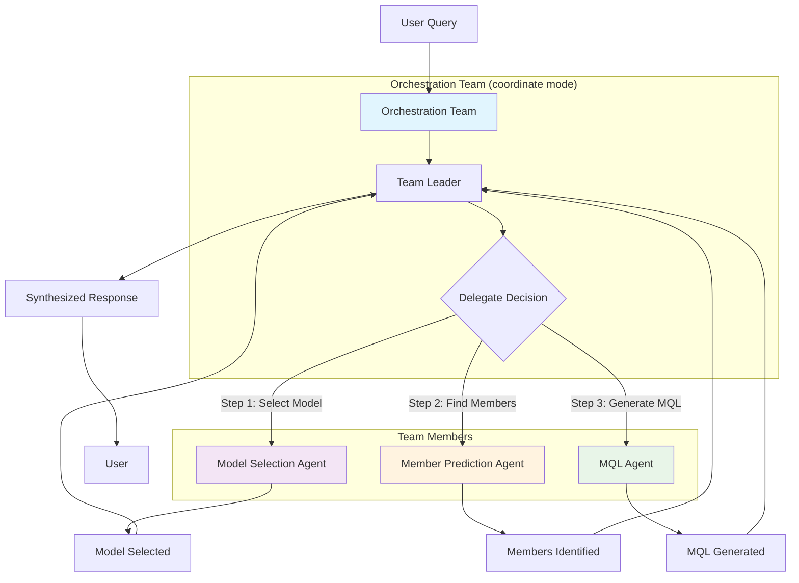
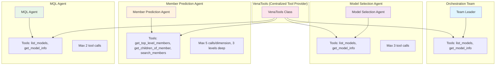
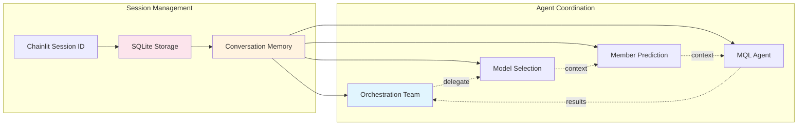
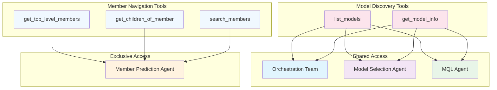

# Agno Multi-Agent Architecture

This diagram shows the team-based agent structure and tool relationship hierarchy in the agno implementation.

## Team Coordination Architecture

## Agent-Tool Relationship Hierarchy

## Session Persistence and Memory Flow

## Tool Distribution Strategy

## Key Components

- **Orchestration Team**: Team leader in "coordinate" mode that delegates tasks and synthesizes responses
- **Model Selection Agent**: Identifies the correct OLAP model using model discovery tools
- **Member Prediction Agent**: Navigates OLAP cube hierarchies using specialized member tools
- **MQL Agent**: Generates Vena MQL queries with validation using model info tools
- **VenaTools**: Centralized tool provider that wraps the shared Vena client
- **Tool Specialization**: Model tools shared among multiple agents, member tools exclusive to Member Prediction
- **Session Persistence**: SQLite storage with conversation memory across all agents
- **Sequential Delegation**: Team leader coordinates workflow through explicit delegation pattern