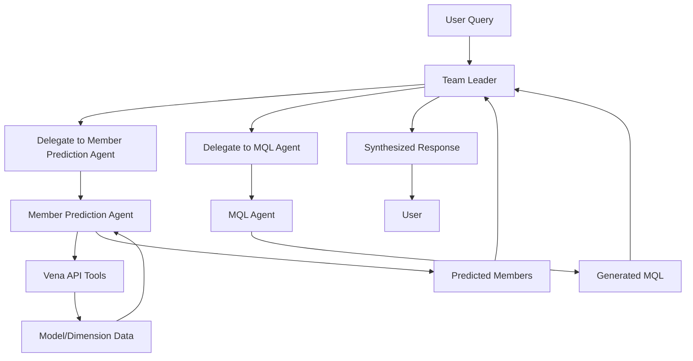

# Agno Multi-Agent Financial Planning System

This implementation replicates the semantic-kernel multi-agent system using the [Agno](https://docs.agno.com/) framework with **enhanced session support and conversation history**.

## 🔄 Session Support & Conversation History

The system now includes full session support for multi-turn conversations:

- **Session Management**: Each chat session gets unique user and session IDs
- **Conversation History**: Agents remember previous interactions within the session
- **Context-Aware Responses**: Agents can reference and build upon earlier exchanges
- **Cross-Session Memory**: Support for referencing previous sessions (configurable)
- **Persistent Storage**: Sessions are stored in SQLite database for persistence

### Session Features
- **Memory.v2**: Multi-user, multi-session memory support
- **History Inclusion**: Last 3-5 conversation turns included in agent context
- **Session Search**: Ability to search across previous sessions
- **Storage Persistence**: All sessions saved to `data/sessions.db`

## System Architecture

### Team-Based Orchestration
The system uses Agno's **Team** concept with "coordinate" mode:

- **Team Leader**: Orchestrates task delegation and synthesizes outputs
- **Specialized Agents**: Handle specific domains (member prediction, MQL generation)
- **Shared Context**: Team maintains shared context across member interactions
- **Session Continuity**: Full conversation history maintained across interactions

### Core Components

#### 1. Orchestration Team (`orchestration_team.py`)
- **Role**: Main coordinator using Agno's Team concept
- **Mode**: "coordinate" - delegates tasks and synthesizes outputs
- **Session Support**: Full memory and storage integration
- **Tools**: Model listing and information retrieval
- **Members**: Member Prediction Agent, MQL Agent

#### 2. Member Prediction Agent (`member_prediction_agent.py`)
- **Role**: Translates natural language to OLAP cube members
- **Session Support**: Remembers previous member searches
- **Tools**: VenaTools for cube exploration
- **Context Awareness**: Uses conversation history to avoid repeating work

#### 3. MQL Agent (`mql_agent.py`)
- **Role**: Generates Vena Model Query Language
- **Session Support**: References previous MQL queries
- **Context**: Builds upon earlier member predictions
- **Output**: SQL-like MQL with explanations

#### 4. Model Selection Agent (`model_selection_agent.py`)
- **Role**: Helps select appropriate financial models
- **Session Support**: Maintains model selection consistency
- **Tools**: Model discovery and information retrieval

#### 5. Vena Tools (`vena_tools.py`)
- **Role**: Interface to Vena API functionality
- **Functions**: Model listing, member search, dimension exploration
- **Integration**: Seamlessly integrated with all agents

#### 6. Chat Service (`chat_service.py`)
- **Role**: Centralized configuration management
- **Features**: Azure OpenAI setup, Memory configuration, Storage setup
- **Session Support**: Provides Memory.v2 and SQLite storage

## Session Configuration

### Team-Level Session Settings
```python
# Team configuration (supported parameters)
add_history_to_messages=True     # Include conversation history
num_history_runs=5               # Last 5 conversation turns
memory=get_memory_config()       # Memory.v2 for session support
storage=get_storage_config()     # SQLite storage for persistence
```

### Agent-Level Session Settings
```python
# Individual agent configuration (additional parameters available)
add_history_to_messages=True     # Include conversation history
num_history_runs=3               # Last 3 conversation turns
search_previous_sessions_history=True  # Search across sessions (agents only)
num_history_sessions=2           # Include last 2 sessions (agents only)
memory=get_memory_config()       # Memory.v2 for session support
storage=get_storage_config()     # SQLite storage for persistence
```

### Storage Configuration
```python
# SQLite storage for session persistence
storage = SqliteStorage(
    table_name="agno_sessions",
    db_file="data/sessions.db"
)
```

## Quick Start

### 1. Install Dependencies
```bash
# Install required packages
pip install agno chainlit python-dotenv azure-identity
```

### 2. Environment Setup
Create a `.env` file:
```env
# Azure OpenAI Configuration
OPENAI_ENDPOINT=your_azure_endpoint
OPENAI_DEPLOYMENT_NAME=your_deployment_name  
OPENAI_API_VERSION=2024-02-15-preview

# Vena API Configuration
VENA_API_KEY=your_vena_api_key
VENA_BASE_URL=your_vena_base_url

# Optional: Local Model Override
LOCAL_MODEL_OVERRIDE=false
```

### 3. Run the System
```bash
# Start the Chainlit server
python server.py

# Or use chainlit directly
chainlit run server.py
```

### 4. Session Usage
1. **Start Session**: Each new chat automatically creates a unique session
2. **Continue Conversation**: Ask follow-up questions that reference previous context
3. **Build Upon Results**: Agents remember previous model selections, member searches, and MQL queries
4. **Session Persistence**: Close and reopen - session history is maintained

## Session Examples

### Example 1: Context-Aware Follow-up
```
User: "What is top revenue across all departments in 2022?"
System: [Generates MQL with member predictions]

User: "Now show me the same data for 2023"
System: [References previous model and members, only changes year]
```

### Example 2: Building on Previous Work
```
User: "List available financial models"
System: [Shows models, user selects Model ID 5]

User: "What departments are available in that model?"
System: [Remembers Model ID 5, searches departments]

User: "Generate MQL for sales department revenue"
System: [Uses remembered model and department context]
```

## Session Management

### Session Information
- **Session ID**: Displayed in welcome message and error messages
- **User ID**: Unique identifier for each chat session
- **Storage Location**: `data/sessions.db` (automatically created)
- **History Retention**: Configurable number of turns and sessions

### Session Benefits
1. **Continuity**: No need to repeat model selections or context
2. **Efficiency**: Agents avoid redundant API calls
3. **Context**: Better understanding of user intent over time
4. **Learning**: System builds knowledge within conversation flow

## Technical Implementation

### Session Flow
1. **Initialization**: Generate unique user_id and session_id
2. **Memory Setup**: Configure Memory.v2 with SQLite storage
3. **Agent Configuration**: Enable history inclusion for all agents
4. **Team Coordination**: Maintain shared context across members
5. **Persistence**: Store all interactions for future reference

### Error Handling
- Session information included in error messages
- Graceful fallback when session features unavailable
- Clear troubleshooting guidance with session context

## Comparison with Original

| Feature | Original (Semantic Kernel) | Enhanced (Agno + Sessions) |
|---------|----------------------------|----------------------------|
| Architecture | Plugin-based orchestration | Team-based coordination + Sessions |
| Memory | Stateless | Multi-session persistent memory |
| Context | Per-request only | Cross-conversation context |
| Agents | Individual plugins | Collaborative team members |
| History | None | Full conversation history |
| User Experience | Repetitive setup | Context-aware continuity |
| Scalability | Limited | Enhanced with session management |

## Advanced Configuration

### Custom Session Settings
```python
# Customize memory retention
team = Team(
    memory=Memory(),
    add_history_to_messages=True,
    num_history_runs=10,          # More history
    search_previous_sessions_history=True,
    num_history_sessions=5,       # More sessions
    # ... other settings
)
```

### Production Considerations
- Replace UUID-based user_id with actual authentication
- Configure database connection pooling for high concurrency
- Set up session cleanup/archival processes
- Monitor session storage growth
- Implement user-specific session isolation

## Benefits of Session-Enhanced System

1. **User Experience**: Seamless multi-turn conversations
2. **Efficiency**: Reduced redundant operations  
3. **Context Awareness**: Better understanding of user needs
4. **Scalability**: Multi-user, multi-session support
5. **Persistence**: Conversations survive application restarts
6. **Intelligence**: Agents learn from conversation patterns

The session-enhanced Agno implementation provides a significantly improved user experience while maintaining full compatibility with the original system's functionality.

## Architecture

The system uses Agno's **Team** feature in **coordinate mode**, where a team leader delegates tasks to specialized agents and synthesizes their outputs into cohesive responses.

### 👥 Financial Planning Team
- **Mode**: Coordinate (team leader delegates and synthesizes)
- **Leader**: Team coordinator that manages workflow and combines results
- **Members**: Two specialized agents working collaboratively

### 🔍 Member Prediction Agent  
- **Role**: Translates natural language questions into relevant OLAP cube members
- **Capabilities**:
  - Model selection and dimension analysis
  - Hierarchical member search and exploration
  - Smart member prediction based on query context
- **Tools**: VenaTools for interacting with Vena API

### 📝 MQL Agent
- **Role**: Generates syntactically-correct Vena MQL queries
- **Expertise**:
  - Deep knowledge of Vena MQL syntax and operators
  - Complex query construction with unions, intersections, and functions
  - Best practices for financial data querying

### 🚀 Team Coordination Benefits
- **Intelligent Delegation**: Team leader routes tasks to appropriate specialists
- **Response Synthesis**: Combines outputs from multiple agents into coherent answers
- **Workflow Visibility**: Shows how each team member contributes to the solution
- **Better Error Handling**: Team-level error management and fallback strategies

## Key Features

- **Multi-Modal Architecture**: Agents work collaboratively with shared context
- **Vena Integration**: Native support for Vena OLAP cube operations
- **Flexible Model Support**: Works with both Azure OpenAI and local models
- **Interactive UI**: Beautiful Chainlit interface for easy interaction
- **Error Handling**: Robust error handling and user feedback

## Environment Setup

Create a `.env` file with the following variables:

```env
# Azure OpenAI Configuration (default)
OPENAI_ENDPOINT=your_azure_openai_endpoint
OPENAI_DEPLOYMENT_NAME=your_model_deployment_name
OPENAI_API_VERSION=2024-02-01

# Or for local model override
LOCAL_MODEL_OVERRIDE=llama3:8b  # Set to model name to use local Ollama

# Vena API Configuration
VENA_ENDPOINT=your_vena_endpoint
VENA_USER=your_vena_username
VENA_KEY=your_vena_api_key
```

## Installation

1. Install dependencies:
```bash
pip install agno chainlit python-dotenv requests
```

2. Run the server:
```bash
chainlit run server.py
```

## Usage Examples

### Query 1: Revenue Analysis
```
"What is top revenue across all departments in 2022?"
```

**Team Workflow:**
1. **Team Leader** → Delegates member prediction task to Member Prediction Agent
2. **Member Prediction Agent** → Identifies relevant dimensions (Account, Department, Period)
3. **Team Leader** → Delegates MQL generation to MQL Agent with found members
4. **MQL Agent** → Generates: `dimension('Account': bottomlevel('Revenue')) dimension('Period': '2022')`
5. **Team Leader** → Synthesizes both outputs into comprehensive response

### Query 2: Departmental Expenses
```  
"Show me total expenses by department for Q4"
```

**Team Workflow:**
1. **Team Leader** → Coordinates task delegation between specialists
2. **Member Prediction Agent** → Finds expense accounts and Q4 period members
3. **MQL Agent** → Creates appropriate MQL with expense filtering
4. **Team Leader** → Combines results and explains the analysis process

## Team Communication Flow



## Differences from Semantic Kernel Version

### Advantages of Agno Implementation:
- **Simplified Architecture**: No complex plugin system, tools are native
- **Better Performance**: Agents instantiate in ~3μs vs semantic-kernel overhead
- **Native Multi-Modal**: Built-in support for various input/output types
- **Model Agnostic**: Easy switching between 23+ model providers
- **Memory & State**: Built-in session management and agent memory

### Feature Parity:
- ✅ Same agent roles and responsibilities
- ✅ Identical Vena API integration
- ✅ Equivalent MQL generation capabilities
- ✅ Same Chainlit UI experience
- ✅ Azure OpenAI and local model support

## Files Structure

```
agno/
├── financial_planning_team.py  # 🆕 Main team coordinator using Agno Teams
├── member_prediction_agent.py  # OLAP member prediction specialist
├── mql_agent.py                # MQL query generation expert  
├── vena_tools.py               # Vena API tools
├── chat_service.py             # Shared model configuration
├── server.py                   # Chainlit server (updated for teams)
└── README.md                   # This file
```

## Contributing

This implementation demonstrates how to migrate from Semantic Kernel to Agno while maintaining full functionality and improving performance. The modular design makes it easy to extend with additional agents or tools.

For more information about Agno, visit [docs.agno.com](https://docs.agno.com). 