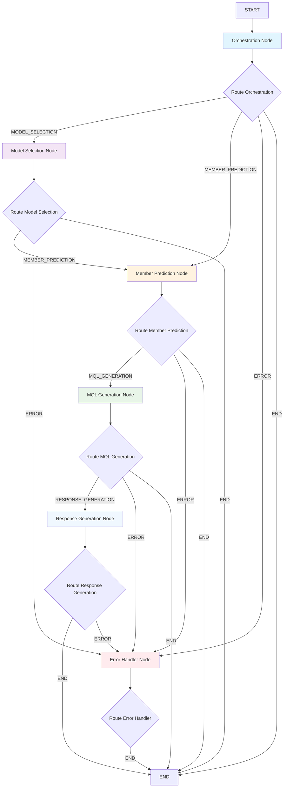
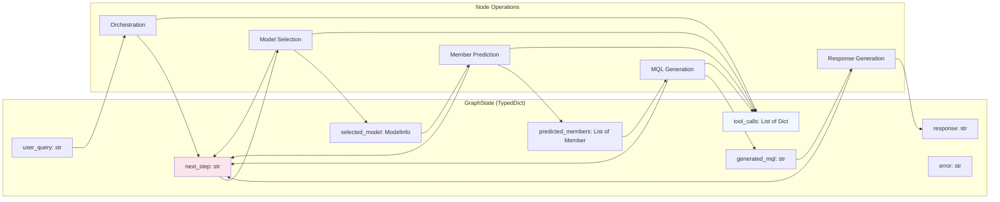
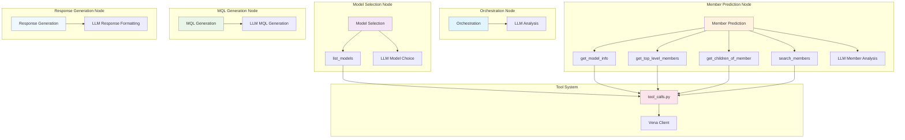
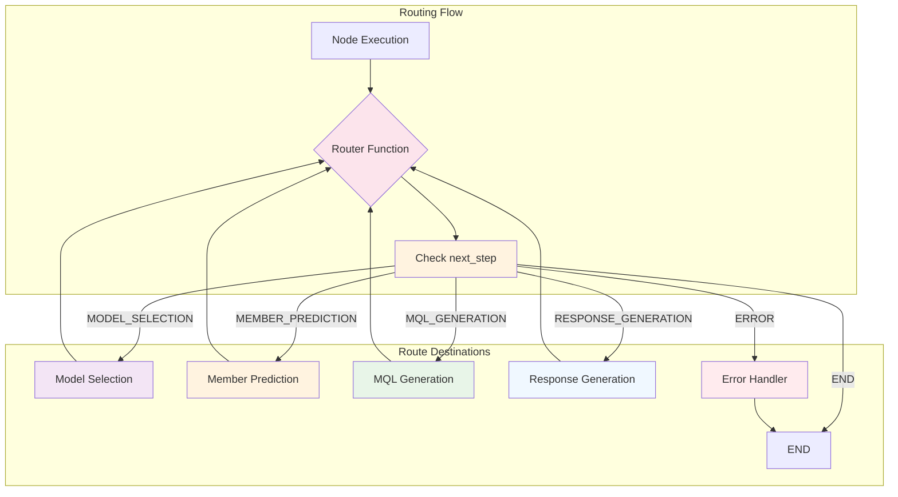
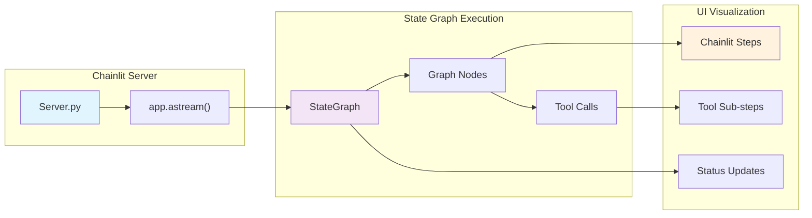

# LangGraph Multi-Agent State Flow

This diagram shows the state graph architecture and agent flows in the langgraph implementation.

## StateGraph Flow Architecture

## State Management and Data Flow

## Node-Tool Integration

## Conditional Routing Logic

## Streaming and UI Integration

## Key Components

- **StateGraph**: Sequential pipeline with conditional routing based on `next_step` field
- **GraphState**: TypedDict that preserves complete state between nodes with accumulative tool call tracking
- **Router Functions**: Deterministic routing logic based on string matching in `next_step`
- **Tool Integration**: Structured tool calls with error handling and UI visualization
- **Node Specialization**: Each node handles specific domain (orchestration, model selection, member prediction, MQL generation, response formatting)
- **Error Handling**: Dedicated error node with comprehensive error propagation
- **Streaming**: Real-time execution updates through Chainlit with step-by-step visualization
- **State Persistence**: Immutable state updates with complete data flow tracking