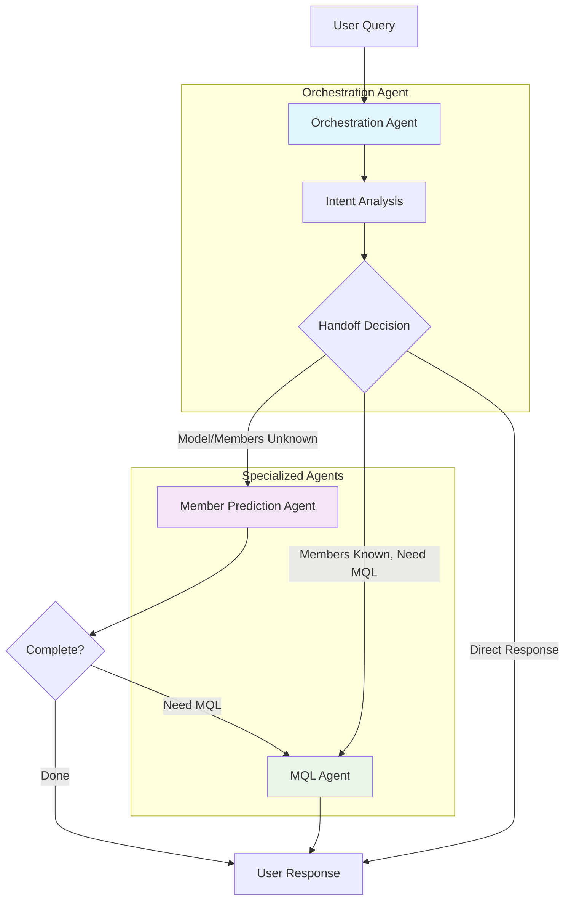
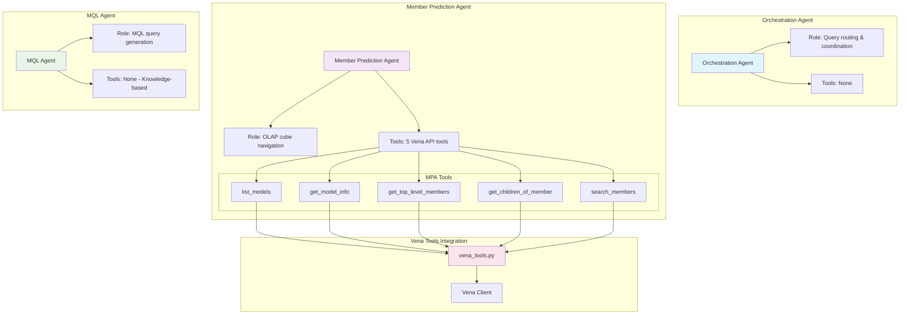
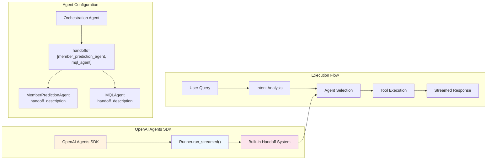
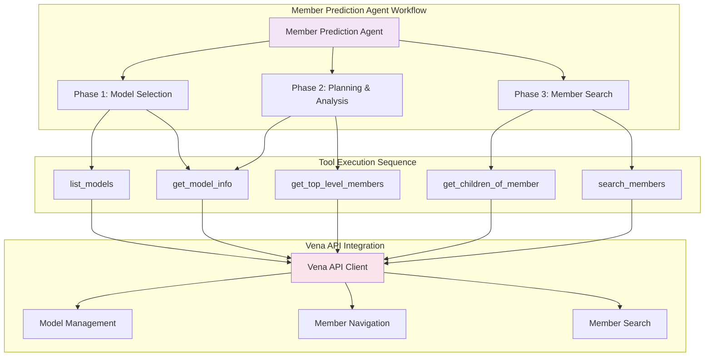
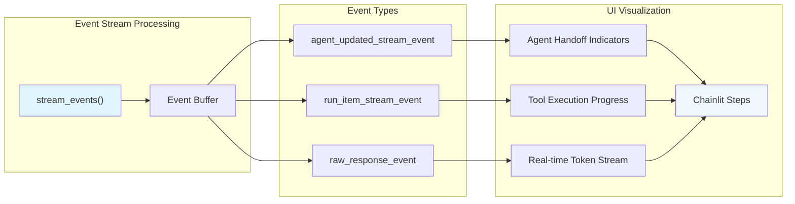
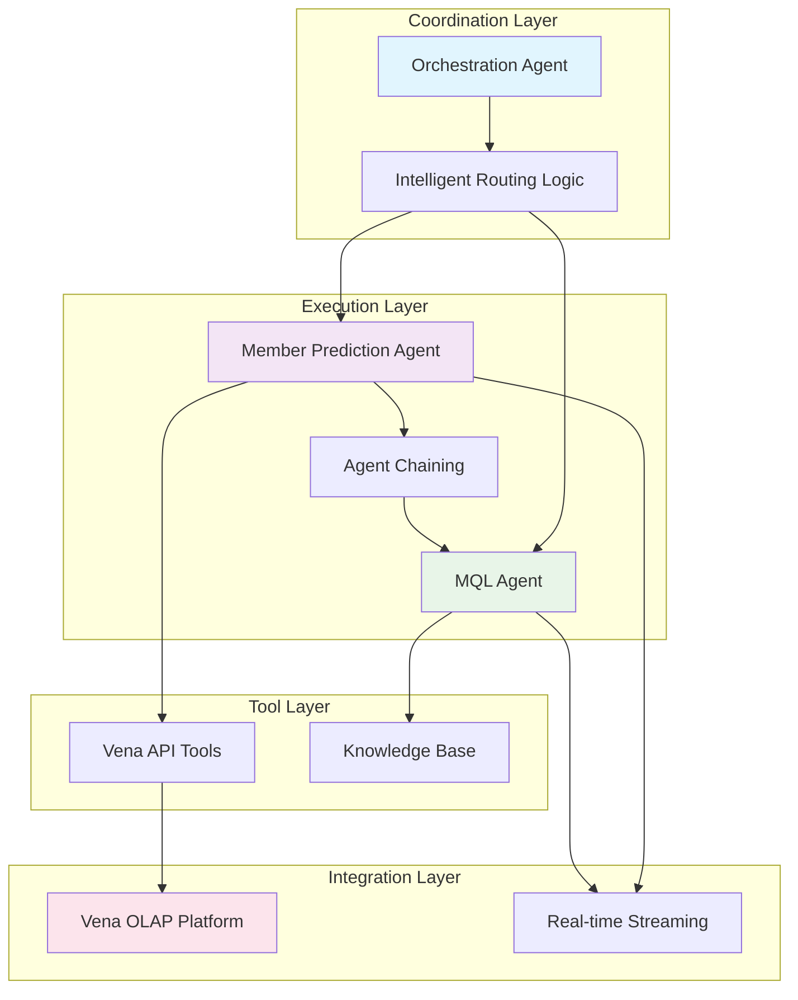

# OpenAI Agents Multi-Agent Architecture

This diagram shows the agent hierarchies and tool calling setup in the openai-agents implementation.

## Agent Hierarchy with Handoff System

## Agent-Tool Distribution

## Built-in Handoff System

## Tool Calling Flow

## Streaming and Event Handling

## Multi-Agent Coordination Pattern

## Key Components

- **Orchestration Agent**: Top-level coordinator with handoff references to specialized agents
- **Member Prediction Agent**: OLAP specialist with 5 Vena API tools for model and member operations
- **MQL Agent**: Knowledge-based query generator with no tools (embedded MQL expertise)
- **Built-in Handoff System**: OpenAI Agents SDK native handoff with direct object references
- **Tool Distribution**: Centralized tools in vena_tools.py with @function_tool decorators
- **Streaming Architecture**: Event-driven streaming with real-time progress tracking
- **Agent Chaining**: MemberPredictionAgent → MQLAgent workflow for end-to-end processing
- **Error Handling**: SDK-specific exception handling with comprehensive error types