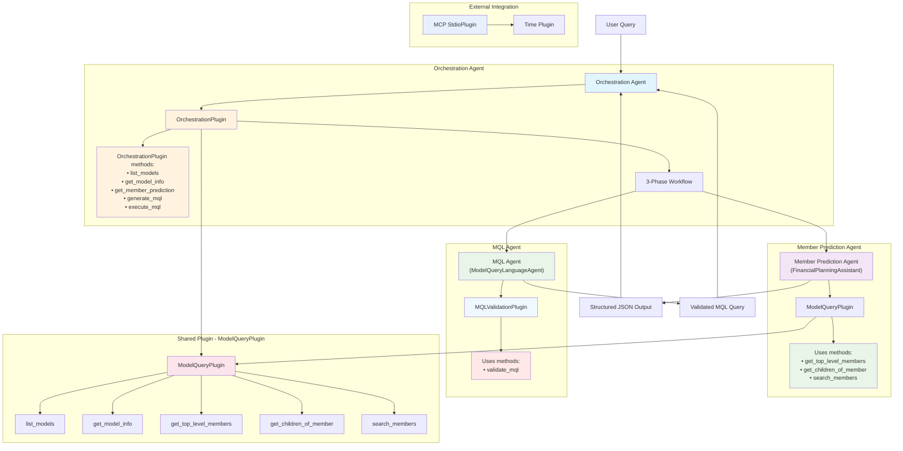
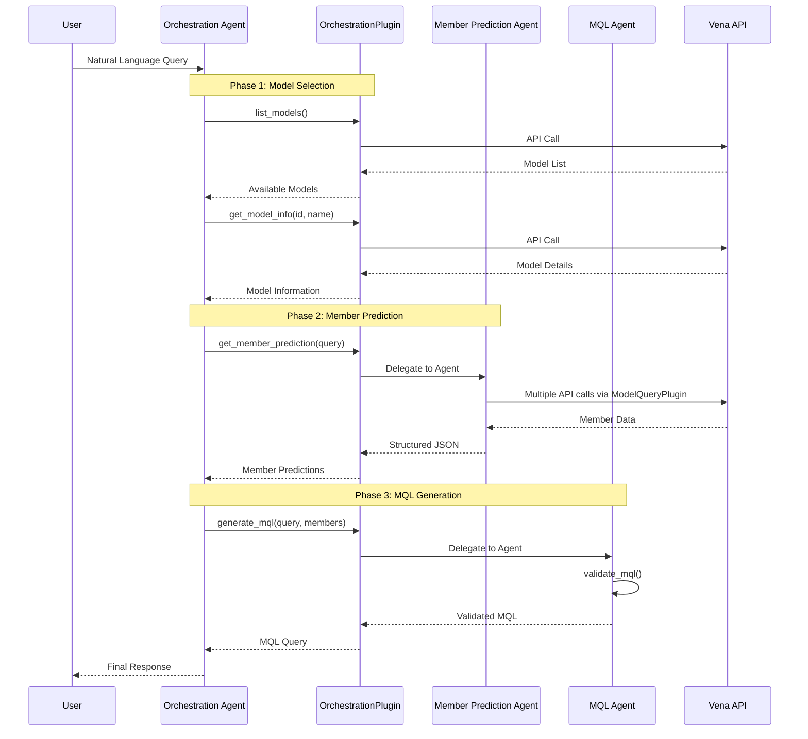
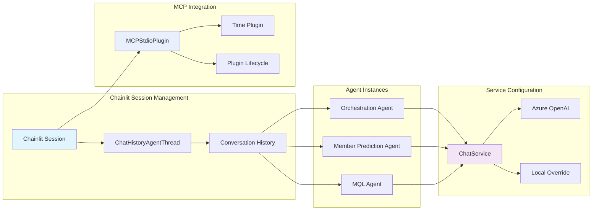

# Semantic Kernel Multi-Agent Architecture

This diagram shows the plugin-mediated agent structure and coordination patterns in the semantic-kernel implementation.

## Agent Hierarchy with Plugin Distribution

## Workflow Coordination Pattern

## Session and Threading Architecture

## Key Components

- **Orchestration Agent**: Central coordinator with `OrchestrationPlugin` containing 5 kernel functions for workflow management
- **Plugin-Mediated Coordination**: Uses plugin functions as primary mechanism for agent-to-agent communication
- **Shared Plugin Architecture**: `ModelQueryPlugin` is reused across orchestration and member prediction agents
- **Specialized Plugins**: `MQLValidationPlugin` provides domain-specific validation for MQL Agent
- **MCP Integration**: External time plugin demonstrates Model Context Protocol integration
- **3-Phase Workflow**: Sequential model selection → member prediction → MQL generation with validation
- **Session Persistence**: Chainlit-based session management with `ChatHistoryAgentThread`
- **Streaming Support**: Real-time response streaming through `invoke_stream`
- **Azure Integration**: Native Azure OpenAI with AD authentication and local model fallback